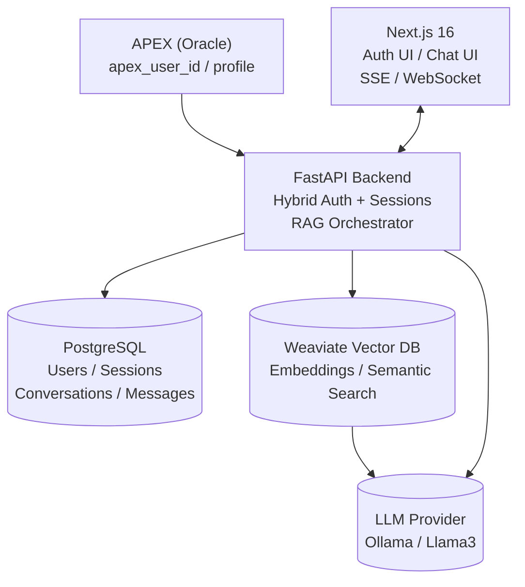
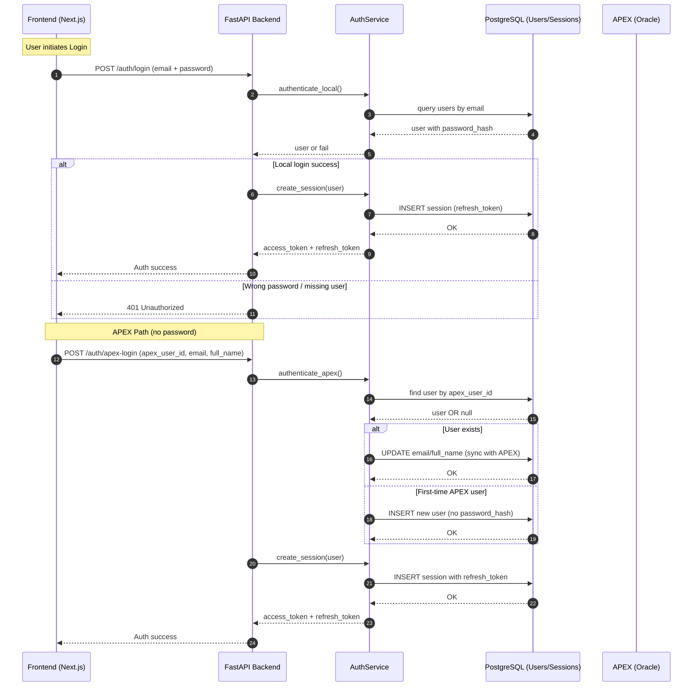

# Πυθία (Pithia) - Greek Army RAG System

<div align="center">


**"ΔΟΣ ΜΟΙ ΠΑ ΣΤΩ ΚΑΙ ΤΑΝ ΓΑΝ ΚΙΝΑΣΩ" — Archimedes**

[](https://fastapi.tiangolo.com/)
[](https://nextjs.org/)
[](https://www.python.org/)
[](https://www.postgresql.org/)
[](https://weaviate.io/)

---

</div>

# 📖 Overview

**Πυθία** είναι ένα σύγχρονο AI σύστημα αναζήτησης για το Ελληνικό Στρατό.  
Επιτρέπει στο προσωπικό να αναζητά στρατιωτικούς κανονισμούς, διαδικασίες και έγγραφα μέσω φυσικής γλώσσας.

Βασίζεται σε **RAG (Retrieval-Augmented Generation)**, συνδυάζοντας:

- 🧭 **Semantic Search** (Weaviate Vector DB)  
- 🧠 **LLM Reasoning** (Ollama / Llama 3.2)  
- 🔐 **Hybrid Authentication** (APEX + Local Password)  
- ⚡ **FastAPI + Next.js** για υψηλή απόδοση  
- 📚 **PDF & Markdown ingestion** με embeddings



# 🧬 Core Features

### 🔐 Hybrid Authentication
- Local Login (email + password)  
- APEX Login (no password)  
- Αυτόματη δημιουργία local mirror user για κάθε APEX login  
- Refresh token rotation & sessions σε PostgreSQL  

### 🔍 RAG Pipeline
- PDF / Markdown ingestion  
- Intelligent chunking  
- Embedding generation  
- Weaviate vector search  
- Reranker  
- LLM reasoning  
- Context-aware answers με citations  

### 💬 Chat with history
- Conversations per user  
- Messages stored with roles (user/assistant/system)  

### 🐳 Full Docker Environment
- Backend API  
- Frontend (Next.js)  
- PostgreSQL  
- Weaviate  

# 🧱 Backend Structure

```
backend/
├── app/
│   ├── api/
│   │   └── routes/
│   │       ├── auth.py
│   │       ├── query.py
│   │       ├── upload.py
│   │       └── health.py
│   ├── core/
│   │   ├── config.py
│   │   ├── security.py
│   │   └── middleware.py
│   ├── services/
│   │   ├── auth.py
│   │   ├── rag_service.py
│   │   ├── embeddings.py
│   │   └── vectordb.py
│   ├── models/
│   │   ├── user.py
│   │   ├── session.py
│   │   ├── conversation.py
│   │   └── message.py
│   ├── schemas/
│   │   ├── auth.py
│   │   ├── user.py
│   │   ├── query.py
│   │   └── rag.py
│   ├── db/
│   │   ├── engine.py
│   │   ├── session.py
│   │   └── migrations/
│   └── main.py
└── Dockerfile
```

# 🗄️ Database Schema

**Users**
```
id UUID PK
email CITEXT NULL
password_hash TEXT NULL
apex_user_id TEXT UNIQUE NULL
full_name TEXT
role TEXT DEFAULT 'user'
created_at TIMESTAMP
updated_at TIMESTAMP
```

**Sessions**
```
id UUID PK
user_id UUID FK
refresh_token TEXT UNIQUE
user_agent TEXT
ip_address TEXT
expires_at TIMESTAMP
```

**Conversations & Messages**
- Chat history storage.

# 🔐 Authentication Flows




## Local Login
`POST /auth/login`

Form fields:
- `username=email`
- `password=***`

## APEX Login
`POST /auth/apex-login`

```json
{
  "apex_user_id": "...",
  "email": "soldier@army.gr",
  "full_name": "ΠΑΠΑΔΟΠΟΥΛΟΣ ΙΩΑΝΝΗΣ"
}
```

✔ Αν δεν υπάρχει χρήστης → δημιουργείται local mirror  
✔ Αν υπάρχει → ενημερώνεται το profile  

# 🧮 RAG Pipeline Flow

1. Load PDF / Markdown  
2. Split into chunks  
3. Generate embeddings  
4. Upsert in Weaviate  
5. Query embedding  
6. Semantic search  
7. Reranking  
8. LLM reasoning  
9. Final answer with citations  

# 🖥️ Frontend (Next.js 16)

- Server Actions  
- Secure token handling  
- Login + APEX login  
- Chat UI with streaming (SSE / WebSocket)  
- Tailwind + Radix UI + ShadCN  
- Conversation history  

# ⚙️ Quick Start

## Start with Docker

```bash
docker-compose up -d
```

Frontend: http://localhost:3000  
Backend:  http://localhost:8000  
Docs:     http://localhost:8000/api/docs  

## Local Dev (manual)

Backend
```bash
cd backend
python3 -m venv venv
source venv/bin/activate
pip install -r requirements.txt
cp env.example .env
python -m uvicorn app.main:app --reload --port 8000
```

Frontend
```bash
cd code
npm install
cp .env.local.example .env.local
npm run dev
```

# 🐛 Troubleshooting Steps for Root Cause Analysis

- **flash_attn warning**: optional; install `flash-attn` if you want faster attention on supported GPUs.
- **Weaviate unreachable**: check `WEAVIATE_URL` and container status.
- **Ollama model missing**: `ollama pull jobautomation/OpenEuroLLM-Greek:latest` (or the configured model).


